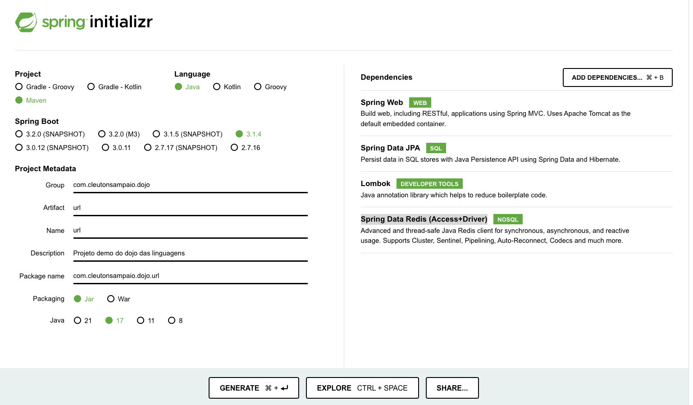

# Implementação Java

Confira o [**meu curso**](https://www.udemy.com/course/bootcamp-dev-senior/?referralCode=A75BA46BC1F06CD04A51)

Você não conseguirá criar um RESTful service utilizando apenas Java. Ao contrário de outras linguagens de programação, Java é extremamente verbosa para isto. Em princípio, você poderia utilizar o pacote java.net, criar socket etc, mas isso seria antiprodutivo e não é o que as pessoas utilizam por aí.

Para ser justo, usei o pacote **Spring**, muito popular entre os desenvolvedores **backend**.

O **Spring** é o framework mais utilizado para aplicações Java/REST. Ele tem uma ferramenta de **scaffolding** genial chamada: [**Spring Initializr**](https://start.spring.io/) que gera uma aplicação Java utilizando o **Spring Boot**, que é uma camada de bibliotecas para facilitar a criação de aplicações Java/Spring.

É possível criar essa aplicação apenas com **JAX-RS**, a implementação padrão, porém não é o mais usual. 

Nem vamos entrar em muitos detalhes sobre Spring aqui. Vamos apenas criar o **backend** da nossa app que guarda e retorna URLs.

O projeto Java já está criado aqui neste repositório para você. Se quiser repetir os passos criando você mesmo uma aplicação, o que eu recomendo muito para que faça um "test-drive" da linguagem, siga estes passos. 

Se quiser apenas executar esta aplicação: 

1. Suba uma instância de REDIS no Docker: 

```
docker run -d -p 6379:6379 --name redis redis
```

2. Abra a pasta raiz do projeto e execute: 

```
mvn spring-boot:run
```

3. No terminal, poste uma URL: 
```
curl -X POST -H "Content-Type: text/plain" -d "https://www.example.com" http://localhost:8080/urls
```

4. Agora obtenha as URLs cadastradas: 

```
curl http://localhost:8080/urls
```

Parabéns! Você tem um RESTful service feito em Java com Spring acessando um database REDIS. 

## Construindo do zero

1. Comece inicializando um novo projeto **Spring Boot**: 

Acesse [Spring Initializr](https://start.spring.io/), selecionando `Web`, `JPA`, `Lombok` e `Redis` como dependências. Gere e baixe o projeto. Aqui você vai escolher inclusive o nome do pacote da sua aplicação. Selecione **maven**: 



2. No pacote principal do seu projeto (src/main/java/{pacote}/), crie o código abaixo (cuidado para alterar o nome do pacote conforme a sua escolha):

```
package com.{nome do seu pacote};
import org.springframework.beans.factory.annotation.Autowired;
import org.springframework.data.redis.core.RedisTemplate;
import org.springframework.web.bind.annotation.*;
import java.util.Set;

@RestController
@RequestMapping("/urls")
public class UrlController {

    @Autowired
    private RedisTemplate<String, String> redisTemplate;

    @GetMapping
    public Set<String> getUrls() {
        return redisTemplate.opsForSet().members("urls");
    }

    @PostMapping
    public void addUrl(@RequestBody String url) {
        redisTemplate.opsForSet().add("urls", url);
    }
}

```

3. Altere a linha abaixo na classe **UrlApplication**:

**de:**
```
@SpringBootApplication
```
**para:**
```
@SpringBootApplication(exclude = { DataSourceAutoConfiguration.class})
```

4. Adicione as propriedades do **REDIS** no "src/main/resources/application.properties": 
```
spring.redis.host=localhost
spring.redis.port=6379
```

5. Inicie o **REDIS** no **Docker**:
```
docker run -d -p 6379:6379 --name redis redis
```

6. Inicie a sua aplicação **Java/SpringBoot**: 
```
mvn spring-boot:run
```
