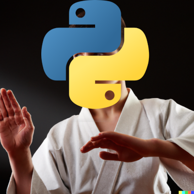

# Implementação Python

Confira o [**meu curso**](https://www.udemy.com/course/programacao-backend-com-python/?referralCode=66FCB81EBF2D08B0FF7D).

Python é uma linguagem de programação simples porém muito poderosa e versátil. É possível criar facilmente uma aplicação **REST** sem utilizar biblioteca ou framework algum, porém, o framework **Django** é extremamente popular no mundo Python e, por esta razão, resolvi utilizá-lo. 

## Executando a aplicação

Se você clonou o repositório, é preciso instalar o Django e suas dependências: 

```
pip install django djangorestframework django-redis redis
```

Inicie o **REDIS**: 
```
docker run -d -p 6379:6379 --name redis redis
```

Para executar a aplicação, entre na pasta "/url" e rode: 
```
python manage.py runserver
```

Para cadastrar URLs: 
```
curl -X POST -H "Content-Type: application/json" -d '{"url": "https://www.example.com"}' http://localhost:8000/api/urls/add/
```

Para obter as URLs cadastradas: 
```
curl http://localhost:8000/api/urls/
```

## Se você quiser criar uma app do zero

Usar o Django é muito fácil. Depois de instalar a dependência, basta você criar a aplicação com: 
```
django-admin startproject url
cd url
```

Você criou o projeto **Django**, agora, temos que criar uma app para colocar nesse projeto: 
```
python manage.py startapp url_app
```

Ele vai criar uma pasta paralela à primeira, contendo sua app. Agora, você precisa ligar a app ao projeto. Abra a pasta "url" e edite o arquivo: "settings.py". Procure por "INSTALLED_APPS" e acrescente essas duas: 
```
INSTALLED_APPS = [
    ...
    'rest_framework',
    'url_app',
]
```

E após esse dicionário, crie esses outros parâmetros: 
```
REST_FRAMEWORK = {
    'DEFAULT_PARSER_CLASSES': [
        'rest_framework.parsers.JSONParser',
    ],
    'DEFAULT_RENDERER_CLASSES': [
        'rest_framework.renderers.JSONRenderer',
    ],
}

# Redis configuration
CACHES = {
    "default": {
        "BACKEND": "django_redis.cache.RedisCache",
        "LOCATION": "redis://127.0.0.1:6379/1",
        "OPTIONS": {
            "CLIENT_CLASS": "django_redis.client.DefaultClient",
        }
    }
}
```

Agora, precisamos mostrar ao Django como serializar as URLs. Crie um arquivo "serializers.py" dentro da pasta da app ("url_app/"):
```
from rest_framework import serializers

class UrlSerializer(serializers.Serializer):
    url = serializers.URLField()
```

E vamos criar nossa View, que efetivamente tratará os requests. Dentro de "url_app/views.py": 
```
from rest_framework.response import Response
from rest_framework.decorators import api_view
from django.core.cache import cache
from .serializers import UrlSerializer

@api_view(['GET'])
def get_urls(request):
    urls = cache.get("urls", [])
    return Response({"urls": urls})

@api_view(['POST'])
def add_url(request):
    serializer = UrlSerializer(data=request.data)
    if serializer.is_valid():
        url = serializer.validated_data['url']
        urls = cache.get("urls", [])
        if url not in urls:
            urls.append(url)
            cache.set("urls", urls)
        return Response({"message": "URL added successfully"})
    return Response(serializer.errors, status=400)
```

Agora, falta pouco! Precisamos criar as rotas da aplicação. Crie as rotas dentro de "url_app/urls.py": 
```
from django.urls import path
from . import views

urlpatterns = [
    path('urls/', views.get_urls, name='get-urls'),
    path('urls/add/', views.add_url, name='add-url'),
]
```

E adicione isso ao projeto ("url/urls.py"): 
```
from django.contrib import admin
from django.urls import path, include

urlpatterns = [
    path('admin/', admin.site.urls),
    path('api/', include('urls_app.urls')),
]
```

Agora é só executar sua aplicação. 
